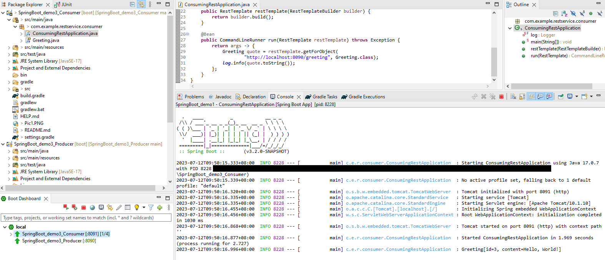
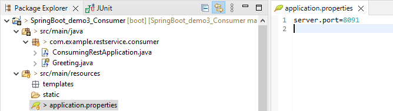

### Spring Boot Demo 3B Rest Service Consumer

**Steps:**
<ol>
<li>To setup IDE for Spring project, follow steps in https://github.com/worldpeacez0991/SpringBoot_demo1</li>

 

<li>Start Spring Boot App
<ul>
<li>Via Spring IDE, open 'ConsumingRestApplication.java', press 'Alt+Shift+X, B', to start 'Spring Boot App'</li>
<kbd></kbd> 

<li>If you see 'Greeting[id=3, content=Hello, World!]' or similar, it means the test PASS! Meaning Consumer can receive the message from Producer.</li>

<li>And, note that Consumer has a different port number from Producer</li>
<kbd></kbd> 

</ul>
</li>

 

</ol>

Credits: https://spring.io/team 
Source: https://spring.io/guides/gs/consuming-rest/

